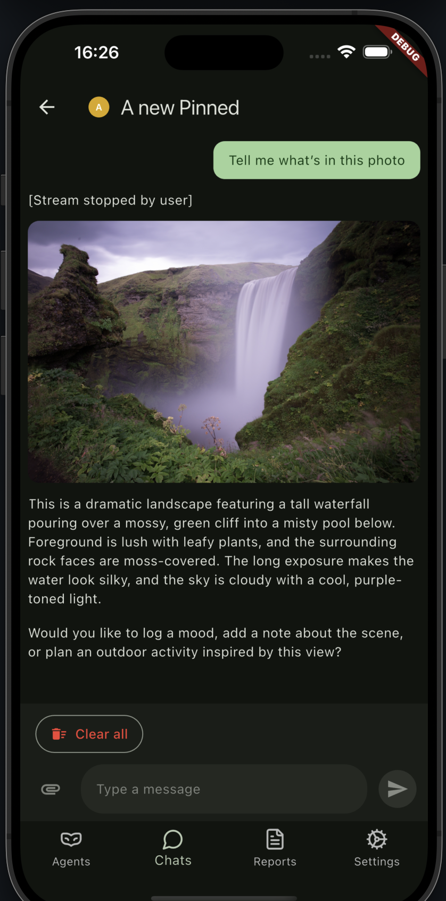

## Contributions Are Welcome

# Flutter AI SDK

Flutter package for consuming AI chat streams from a [Vercel AI SDK](https://ai-sdk.dev/) v5 backend.

## Usage

### Define custom transport

```dart
import 'package:vercel_ai_sdk/vercel_ai_sdk.dart' as vercel;

typedef _TokenProvider = Future<String?> Function();

class _AuthenticatedChatTransport extends vercel.DefaultChatTransport {
  _AuthenticatedChatTransport({
    required super.apiConfig,
    required _TokenProvider tokenProvider,
    Map<String, Object?> Function()? defaultBodyBuilder,
  }) : _tokenProvider = tokenProvider,
       _defaultBodyBuilder = defaultBodyBuilder,
       super();

  final _TokenProvider _tokenProvider;
  final Map<String, Object?> Function()? _defaultBodyBuilder;

  @override
  Future<Stream<vercel.UiMessageChunk>> sendMessages({
    required String chatId,
    required List<vercel.UiMessage> messages,
    Future<void>? abortSignal,
    Map<String, Object?>? metadata,
    Map<String, String>? headers,
    Map<String, Object?>? body,
    required vercel.ChatRequestTrigger trigger,
    String? messageId,
  }) async {
    final token = await _tokenProvider();
    final mergedHeaders = _mergeHeaders(headers, token);
    final mergedBody = _mergeBody(body);
    return super.sendMessages(
      chatId: chatId,
      messages: messages,
      abortSignal: abortSignal,
      metadata: metadata,
      headers: mergedHeaders,
      body: mergedBody,
      trigger: trigger,
      messageId: messageId,
    );
  }

  @override
  Future<Stream<vercel.UiMessageChunk>?> reconnectToStream({
    required String chatId,
    Map<String, Object?>? metadata,
    Map<String, String>? headers,
    Map<String, Object?>? body,
    String? path,
  }) async {
    final token = await _tokenProvider();
    final mergedHeaders = _mergeHeaders(headers, token);
    final mergedBody = _mergeBody(body);
    return super.reconnectToStream(
      chatId: chatId,
      metadata: metadata,
      headers: mergedHeaders,
      body: mergedBody,
      path: path,
    );
  }

  Map<String, Object?>? _mergeBody(Map<String, Object?>? body) {
    final defaults = _defaultBodyBuilder?.call();
    if (defaults == null && body == null) {
      return null;
    }
    return {...?defaults, ...?body};
  }

  Map<String, String>? _mergeHeaders(
    Map<String, String>? headers,
    String? token,
  ) {
    if (token == null || token.isEmpty) {
      return headers;
    }
    final merged = {...?headers};
    merged['Authorization'] = 'Bearer $token';
    return merged;
  }
}
```

#### Initialize

```dart
  void _setupChat() {
    final initialMessages = _buildInitialUiMessages();
    final chatState = vercel.ChatState(messages: initialMessages);
    final apiConfig = vercel.ChatTransportApiConfig(
      apiBaseUrl: widget.apiBaseUrl,
      apiChatPath: '/chat',
    );

    final transport = _AuthenticatedChatTransport(
      apiConfig: apiConfig,
      tokenProvider: _getAuthToken,
      defaultBodyBuilder: _defaultRequestBody,
    );

    final chat = vercel.Chat(
      id: widget.chatId.isNotEmpty ? widget.chatId : null,
      state: chatState,
      transport: transport,
      generateId: () => _uuid.v4(),
      onError: _handleChatError,
      onFinish: _handleChatFinish,
    );

    _chatState?.removeListener(_handleChatStateChange);
    chatState.addListener(_handleChatStateChange);

    _chatState = chatState;
    _chat = chat;

    _handleChatStateChange();
  }
```

#### Send messages

```dart
      chat.sendMessage(input: vercel.SendText(trimmed, metadata: metadata)),
```




_In this example I use ui lib [flutter_chat_ui](https://flyer.chat/)_